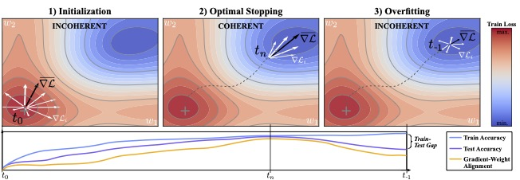

<h1 align='center'>gradient-weight alignment</h1>

This repository contains the implementation for the NeurIPS '25 paper [Gradient-Weight Alignment as a Train-Time Proxy for Generalization in Classification Tasks](https://neurips.cc/virtual/2025/poster/117752).



## Reproduction
You can use [uv](https://docs.astral.sh/uv/) to quickly train a model and see how GWA is computed.
All experiments in the paper where run with JAX.
In order to run experiments you will need to preprocess the corresponding dataset as indicated in `src/datasets/prepare`.

## Implementation
The per-sample alignment scores can easily be computed with minor modifications to your training.
For JAX, all required adapations can be found in the `functions.py` and `alignment.py` files inside `src/training`.
A quick PyTorch example can be found in `gwa_torch.py`.

There are two main steps to compute alignment:

1. Get the latent embedding of each sample in the batch together with the weigths of the linear classifier head at that time step.
In JAX, latent embeddings can be extracted by e.g. adding `self.sow("latent_embeddings", "x", x)` before passing the activations `x` to the classifier head in the model's call function (see for an example line 122 in `src/networks/convnext.py`).
If set to mutable, this will return `latent_embeddings` when calling your model (see line 27 in `alignment.py`).
The classifier weights can be directly taken from the params of the model's current state.

2. After each forward pass, use the `head_alignment` function to compute the alignment scores for the given batch by passing it the logits, labels, embeddings and classifier weigths (see line 27 in `functions.py`).

GWA, as a scalar early stopping criterion, can be easily computed after each epoch by storing the per-sample alignment scores after each update step (see line 113 and 118 in `src/train.py`).

## Citation
Feel free to use the following citation if you found our paper, metric or code useful:
```bibtex
@inproceedings{hoelzl2025gwa,
  title     = {Gradient-Weight Alignment as a Train-Time Proxy for Generalization in Classification Tasks},
  author    = {H{\"o}lzl, Florian A. and Rueckert, Daniel and Kaissis, Georgios},
  booktitle = {The Thirty-ninth Annual Conference on Neural Information Processing Systems},
  year      = {2025},
  url       = {https://openreview.net/forum?id=UhgpXbOcK1}
}
```
